# Italian Driver's License (Patente A & B) Study Guide

This guide is for English speakers preparing for the Italian Patente A/B theory exam. It draws from the 7,165 quiz questions in this repository, plus theory hints and reference manuals.

## Introduction

### The Exam

The Patente A/B theory exam is a computerized true/false test: 30 questions, 20 minutes, maximum 3 errors to pass.

### The Italian Driving Philosophy

Before memorizing rules, it helps to understand the logic behind them. Italian traffic law is built on a few core principles that, once internalized, make most exam answers feel obvious:

**Prudence over rights.** The single most important concept in the Italian *Codice della Strada* is *prudenza*. Even when you have legal priority, you are expected to drive as though the other person might make a mistake. The exam will repeatedly test whether you understand that having priority does not mean forcing passage. An Italian driver who causes a crash while technically "in the right" is still considered at fault for lacking prudence.

**The hierarchy of authority.** Italian traffic law establishes a strict pecking order: a traffic officer overrides traffic lights, traffic lights override signs, signs override road markings. This isn't just trivia — it reflects how Italians actually navigate daily driving. When a *vigile* (traffic officer) is directing an intersection, everyone ignores the lights. When temporary signs contradict permanent ones, the temporary signs win. The exam loves testing whether you know which layer wins.

**Everything has a precise name.** Italian road law is obsessively specific about terminology. A *strada* is not a *carreggiata* is not a *corsia* is not a *banchina*. Where an English speaker might casually say "road" for all of these, the Italian exam treats each as a distinct legal concept with different rules. Many exam traps are purely definitional — swapping one term for another to see if you notice.

**Safety is collective, not individual.** The Italian system assumes you are responsible not just for yourself but for the safety of everyone around you — pedestrians, cyclists, motorcyclists, passengers. Questions about vulnerable road users almost always favor the more cautious answer. If a choice sounds convenient for the driver but worse for a pedestrian, it is almost certainly false.

**Gradualness.** When the exam asks about responses to hazards — skidding, fog, rain, ice — the correct answer is nearly always the gradual one. Gradual braking, gradual steering, gradual deceleration. Sudden actions are treated as wrong. This reflects a culture where smooth, predictable driving is valued over reactive, aggressive responses.

## Table Of Contents

- [Introduction](#introduction)
- [How To Use This Guide](#how-to-use-this-guide)
- [Quick Reference](#quick-reference)
- [Exam Tips](#exam-tips)
- [Chapter 1: Road & Traffic Definitions](#chapter-1-road--traffic-definitions)
- [Chapter 2: Danger Signs](#chapter-2-danger-signs)
- [Chapter 3: Prohibition Signs](#chapter-3-prohibition-signs)
- [Chapter 4: Mandatory Signs](#chapter-4-mandatory-signs)
- [Chapter 5: Priority / Right-Of-Way Signs](#chapter-5-priority--right-of-way-signs)
- [Chapter 6: Road Markings](#chapter-6-road-markings)
- [Chapter 7: Traffic Lights And Signals](#chapter-7-traffic-lights-and-signals)
- [Chapter 8: Information Signs](#chapter-8-information-signs)
- [Chapter 9: Supplementary Signs](#chapter-9-supplementary-signs)
- [Chapter 10: Supplementary Panels](#chapter-10-supplementary-panels)
- [Chapter 11: Speed Limits](#chapter-11-speed-limits)
- [Chapter 12: Safe Following Distance](#chapter-12-safe-following-distance)
- [Chapter 13: Vehicle Traffic Rules](#chapter-13-vehicle-traffic-rules)
- [Chapter 14: Right-Of-Way Examples At Intersections](#chapter-14-right-of-way-examples-at-intersections)
- [Chapter 15: Overtaking Rules](#chapter-15-overtaking-rules)
- [Chapter 16: Stopping, Parking, Emergency Stop, And Starting Off](#chapter-16-stopping-parking-emergency-stop-and-starting-off)
- [Chapter 17: Road Obstruction, Loads, Trailers, And Emergencies](#chapter-17-road-obstruction-loads-trailers-and-emergencies)
- [Chapter 18: Use Of Lights](#chapter-18-use-of-lights)
- [Chapter 19: Equipment And Safety Devices](#chapter-19-equipment-and-safety-devices)
- [Chapter 20: Driver's Licenses](#chapter-20-drivers-licenses)
- [Chapter 21: Behaviors To Prevent Road Accidents](#chapter-21-behaviors-to-prevent-road-accidents)
- [Chapter 22: Driving, Physical And Mental Fitness, And First Aid](#chapter-22-driving-physical-and-mental-fitness-and-first-aid)
- [Chapter 23: Civil, Criminal, And Administrative Liability](#chapter-23-civil-criminal-and-administrative-liability)
- [Chapter 24: Fuel Economy, Pollution, And Eco-Driving](#chapter-24-fuel-economy-pollution-and-eco-driving)
- [Chapter 25: Vehicle Components Important For Safety](#chapter-25-vehicle-components-important-for-safety)

## How To Use This Guide

Work in layers:

1. **Read each theory summary** to understand the concept and the Italian logic behind it.
2. **Study the key rules** — these are what the exam actually tests.
3. **Do the sample questions** to see how the exam phrases things (the phrasing is often the trap).
4. **Drill in the app** (`yarn start`) until the Italian wording stops feeling foreign.

For sign chapters (2–10), pair this guide with the images in `public/images/`.

## Quick Reference

### Exam Format

- Exam type: computerized true/false quiz
- Question count: 30
- Time limit: 20 minutes
- Maximum mistakes allowed to pass: 3

### General Speed Limits

Unless a sign sets a different limit, the standard limits for cars, motorcycles, and vehicles up to 3.5 t are:

| Road type | Limit |
| --- | --- |
| Urban roads / built-up areas | 50 km/h |
| Urban roads with specific signage and suitable characteristics | up to 70 km/h |
| Secondary extra-urban roads | 90 km/h |
| Main extra-urban roads | 110 km/h |
| Motorways / autostrade | 130 km/h |

Important exam reminders:

- In rain or snow, the maximum is 90 km/h on main extra-urban roads.
- In rain or snow, the maximum is 110 km/h on motorways.
- New drivers in their first 3 years are limited to 90 km/h on main extra-urban roads and 100 km/h on motorways.

### Alcohol Limits

- General legal blood alcohol limit: 0.5 g/L
- New drivers and some professional categories: 0.0 g/L

For exam purposes, the safest rule is simple: if there is any doubt about alcohol, do not drive.

### Distances And Core Numbers

- Minimum tread depth for car tires: 1.6 mm
- Minimum distance behind an operating snowplow or salt spreader: 20 m
- On some extra-urban roads, certain goods vehicles over 3.5 t under an overtaking ban must keep at least 100 m apart

## Exam Tips

### How the exam tries to trick you

The exam is not trying to test whether you've memorized a textbook. It's testing whether you *think like an Italian driver*. Here's how it does that:

**Terminology swaps.** The most common trap is replacing one precise Italian term with another. The exam will say "the carriageway includes cycle paths" — false, because *carreggiata* and *pista ciclabile* are different things. If you've internalized the Italian habit of giving every road element its own legal identity, these become easy.

**Absolute language.** Statements with "always," "only," "never," or "in every case" are usually false — unless the rule really is absolute (like "you must always wear a seatbelt"). The exam exploits the gap between rules that feel absolute and rules that actually are.

**The convenience trap.** If a statement sounds like good news for the driver — "you can park here," "you don't need to slow down," "this exempts you from stopping" — it is probably false. The Italian system is designed to protect the weaker party, and the exam reflects that.

**The false exception.** The exam loves inventing exceptions that don't exist: "except for electric vehicles," "unless the road is dry," "only in built-up areas." If you don't recognize the exception from your study, it's probably made up.

### When in doubt

Ask yourself: *What would the most cautious, predictable driver do?* That is almost always the right answer. The Italian exam rewards drivers who yield when uncertain, slow down when conditions are ambiguous, and never assume others will behave correctly.

## Chapter 1: Road & Traffic Definitions

### Theory Summary

This is the chapter where you learn to see the road the way an Italian sees it — not as a single surface you drive on, but as a precisely labeled collection of zones, each with its own legal identity and rules.

**The anatomy of an Italian road.** Imagine standing at the edge of a typical Italian road. The entire area — from building face to building face — is the *strada*. Within it, the *carreggiata* (carriageway) is only the part where vehicles actually travel. Each *corsia* (lane) within it carries one line of traffic in one direction. The *banchina* (shoulder) sits outside the carriageway — it's not for driving. The *marciapiede* (sidewalk) belongs to pedestrians. The *attraversamento pedonale* (pedestrian crossing) is technically part of the carriageway, but it's where pedestrians have priority over vehicles.

Why does this matter? Because the exam will test whether a cycle path is part of the carriageway (it isn't), whether a shoulder is a lane (it isn't), or whether a traffic island can be parked on (it can't). Every element has a boundary, and the exam lives on those boundaries.

**Road hierarchy.** Italian roads are categorized by design, not just by feel:

- An *autostrada* (motorway) has separated carriageways, emergency lanes, and strict access — no agricultural machines, no mopeds, no pedestrians.
- A *strada extraurbana principale* (main extra-urban road) is similar but without the emergency lane. It has separate carriageways, at least two lanes per direction, and only grade-separated intersections (no traffic lights, no at-grade crossroads).
- Lower-tier roads have progressively fewer requirements and lower speed limits.

The conceptual point: Italians think of road types as a spectrum from fully controlled (motorway) to fully shared (pedestrian zone), and the rules tighten as you move up the hierarchy.

**The duty of care.** The most Italian thing in this chapter: even when you have legal priority, you must be *paziente, prudente, e tollerante* — patient, prudent, and tolerant. You may not insist on going first if there's any doubt about whether others will yield. This isn't just a nice idea; it's a testable legal principle. The exam will present scenarios where you technically have priority and ask whether you can force passage. The answer is always no.

### Key Rules & Facts

- The road includes carriageways, shoulders, sidewalks, and cycle paths.
- The carriageway includes lanes and pedestrian or cycle crossings, but not sidewalks, shoulders, cycle paths running alongside it, or parking lay-bys.
- A lane is one-directional and is designed for one line of vehicles.
- Acceleration lanes are for entering a major road; deceleration lanes are for leaving it.
- Overtaking and stopping are prohibited in acceleration and deceleration lanes.
- The sidewalk is normally for pedestrians. Parking there is allowed only where specific markings permit it.
- A refuge island (`salvagente`) protects pedestrians; it does not divide the directions of travel like a central median.
- A grade-separated intersection uses ramps, overpasses, or underpasses and does not remove the normal speed-limit rules.
- In a limited-traffic zone, only authorized vehicles, or vehicles allowed at the specified times, may circulate.
- Main extra-urban roads have separate carriageways and grade-separated intersections.
- Agricultural machines may not circulate on motorways.
- A passenger car (`autovettura`) carries at most nine people including the driver.
- A camper (`autocaravan`) is a motor vehicle fitted for both transport and accommodation; a caravan is a trailer.
- A driver must remain patient, prudent, and tolerant, and must not insist on going first when priority is uncertain.

### Sample Questions

#### 1. Main extra-urban roads have separate carriageways.

- English statement: `Main extra-urban roads have separate carriageways.`
- Correct answer: `True`
- Why: A `strada extraurbana principale` is defined by separate carriageways or carriageways divided by a median, with at least two lanes in each direction.

#### 2. The carriageway includes cycle paths.

- English statement: `The carriageway includes cycle paths.`
- Correct answer: `False`
- Why: The carriageway is the part for vehicle transit. Sidewalks, shoulders, and cycle paths may run alongside it, but they are not part of it.

#### 3. A pedestrian crossing is part of the carriageway used by pedestrians crossing the road.

- English statement: `A pedestrian crossing is part of the carriageway used by pedestrians crossing the road.`
- Correct answer: `True`
- Why: The crossing is marked directly on the carriageway, and vehicles must yield there.

#### 4. In a limited-traffic zone, only authorized vehicles may circulate.

- English statement: `In a limited-traffic zone, only authorized vehicles may circulate.`
- Correct answer: `True`
- Why: A `zona a traffico limitato` restricts circulation by category, time, or permit.

#### 5. A refuge island is used to divide the directions of travel on a two-way road.

- English statement: `A refuge island is used to divide the directions of travel on a two-way road.`
- Correct answer: `False`
- Why: The `salvagente` is for pedestrian protection and waiting, especially near crossings or public transport stops.

#### 6. A driver may not insist on going first when there is doubt that others will give way.

- English statement: `A driver may not insist on going first when there is doubt that others will give way.`
- Correct answer: `True`
- Why: The driver's duty of care overrides aggressive assumptions about priority.

#### 7. It is allowed to leave a vehicle parked on the sidewalk without space for pedestrians pushing a baby stroller.

- English statement: `It is allowed to leave a vehicle parked on the sidewalk without space for pedestrians pushing a baby stroller.`
- Correct answer: `False`
- Why: The sidewalk is primarily for pedestrians. Blocking safe passage is not allowed.

### Terms To Memorize

| Italian term | English meaning |
| --- | --- |
| strada | road |
| carreggiata | carriageway |
| corsia | lane |
| corsia di accelerazione | acceleration lane |
| corsia di decelerazione | deceleration lane |
| banchina | shoulder |
| marciapiede | sidewalk |
| attraversamento pedonale | pedestrian crossing |
| isola di traffico | traffic island / channelizing island |
| salvagente | pedestrian refuge island |
| intersezione a raso | at-grade intersection |
| intersezione a livelli sfalsati | grade-separated intersection |
| zona a traffico limitato (ZTL) | limited-traffic zone |
| strada extraurbana principale | main extra-urban road |
| autostrada | motorway |

## Chapter 2: Danger Signs

### Theory Summary

Danger signs are triangular with a red border. They don't tell you what to do — they tell you what's coming, and expect you to figure out the appropriate response. This distinction matters: a danger sign never creates a specific speed limit or a specific prohibition by itself. It creates an *obligation to adapt*.

The Italian logic is: "We're warning you. From here, you are responsible for adjusting your speed, attention, and positioning to whatever the hazard requires." The correct response to almost any danger sign is: slow down, pay attention, be ready to stop.

**Commonly confused pairs.** The exam loves testing whether you can distinguish:

- *Dosso* (crest) vs. *cunetta* (dip) — A crest goes up then down and blocks your view ahead. A dip goes down then up and may collect water or debris. They look similar on signs but the hazards are different: crests are about visibility, dips are about grip and obstacles.
- *Curva pericolosa* (dangerous curve) vs. a mandatory direction sign — The curve sign warns; it doesn't command a direction. Many exam questions try to make you think it's an obligation to turn.
- *Strettoia* (narrowing) vs. right-of-way — A narrowing sign warns that the road gets narrow. It does NOT assign priority. If priority is regulated at the narrowing, separate priority signs will be present.

**Railway crossings** are heavily tested. The exam expects you to distinguish crossings with barriers, without barriers, single-track (one Saint Andrew cross), multi-track (double cross), and the countdown approach markers showing distance. The core rule: red lights at a crossing mean stop, period — even if the barrier hasn't come down yet.

### Sign Gallery

The individual sign images below are extracted from the official reference sheets under `docs/assets/sign-source/`.

| Curve to the left | Curve to the right | Single curve right |
| --- | --- | --- |
| 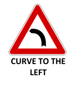 | 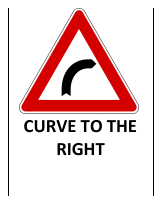 | 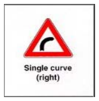 |
| Double curve | Double curve (right then left) | Dangerous downgrade |
| 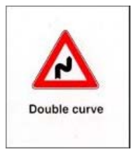 | 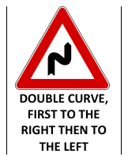 | 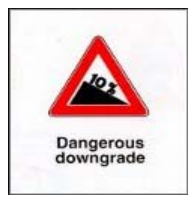 |
| Dangerous downgrade (var.) | Dangerous upgrade | Dangerous upgrade (var.) |
| 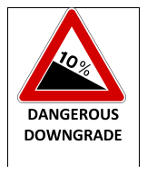 | 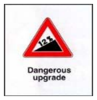 | 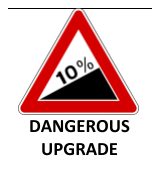 |
| Bumpy road | Rough road | Humps |
| 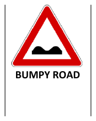 | 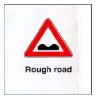 | 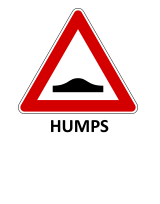 |
| Road narrows | Road narrows (var. 2) | Road narrows (var. 3) |
| 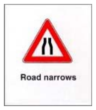 | 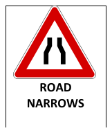 | 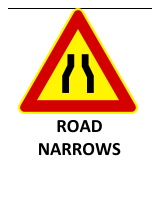 |
| Road narrows right | Narrows on left | Narrows on left (var.) |
| 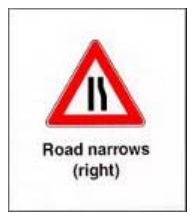 | 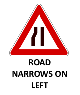 | 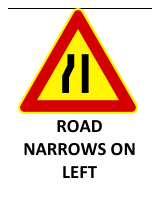 |
| Narrows on right | Narrows on right (var.) | Dangerous verges |
| 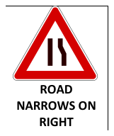 | 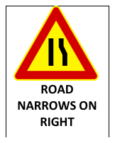 | 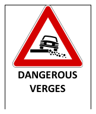 |
| Slippery road | Slippery road (var.) | Materials on the road |
| 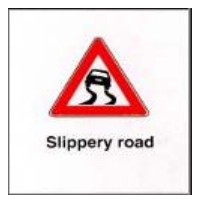 | 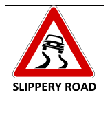 | 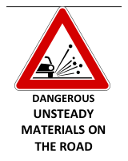 |
| Materials on the road (var.) | Unsteady materials | Falling rocks |
| 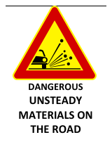 | 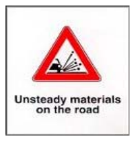 | 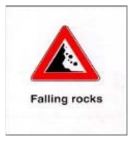 |
| Falling rocks or debris | Side wind | Side winds (var.) |
| 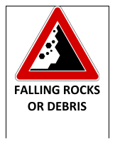 | 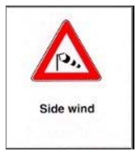 | 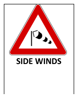 |
| Low-flying aircraft | Bridge | Tunnel |
| 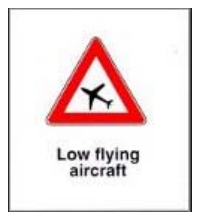 | 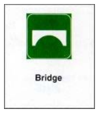 | 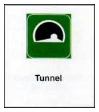 |
| Quay or river bank | River bank | Two-way traffic |
| 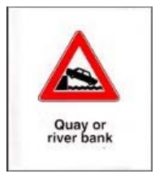 | 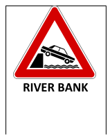 | 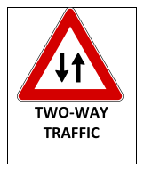 |
| Two-way traffic (var.) | Queue / traffic jam | Traffic accident ahead |
| 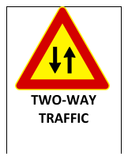 | 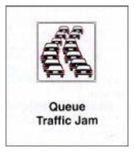 | 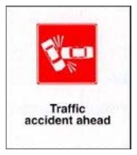 |
| Signal lights ahead | Pedestrian crossing | Pedestrian crosswalk ahead |
| 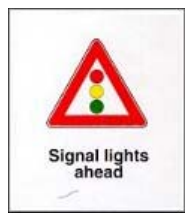 | 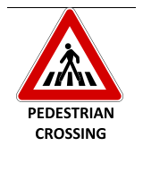 | 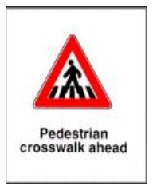 |
| Bicycle crossing | Children | Caution school zone |
| 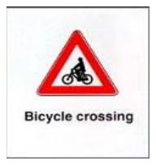 | 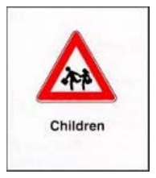 | 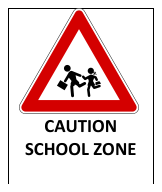 |
| Wild animals | Wild animal crossing | Domestic animal crossing |
| 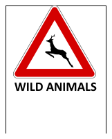 | 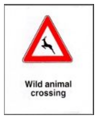 | 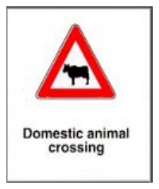 |
| Domestic animals on the road | Crossroads | Crossroads with right-of-way from right |
| 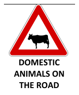 | 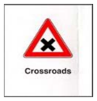 |  |
| Merging traffic from left | Merging traffic from right | Roundabout ahead |
|  |  |  |
| Tramway crossing | Guarded railroad crossing | Unguarded railroad crossing |
|  |  |  |
| Railroad crossing | Railroad crossing (var.) | Railroad crossing (one track) |
|  |  |  |
| Railroad crossing with light | Crossing single track | Crossing multiple tracks |
|  |  |  |
| Crossing ahead | Drawbridge | Drawbridge ahead |
|  |  |  |
| Construction site | Work in progress | Mobile construction site ahead |
|  |  |  |
| Road/yard equipment ahead | Painting in progress | Slow down for trucks |
|  |  |  |
| Risk of fire | Danger (generic) | Danger (var. 2) |
|  |  |  |
| Danger (var. 3) | | |
|  | | |

### Key Rules & Facts

- Danger signs usually warn of a hazard ahead, often roughly 150 m before it in ordinary conditions.
- A danger sign does not usually create a fixed speed rule by itself, but it requires an appropriate reduction of speed.
- On a two-way road with only two lanes, a dangerous curve requires staying as close as practical to the right edge.
- `Dosso` limits visibility; overtaking on the uphill portion is forbidden on two-way two-lane roads.
- `Cunetta` is not the same as a crest and may collect water, mud, or debris.
- A slippery-road sign requires gentle steering, braking, and acceleration.
- A narrowing-road sign warns of meeting difficulty; it does not automatically mean alternating one-way traffic.
- At a level crossing, red lights, barriers, half-barriers, warning bells, or blocking barriers mean you must stop.
- A Saint Andrew cross marks a railway crossing close to the tracks, not a generic intersection.

### Sample Questions

#### 1. The sign shown warns of the likely sudden crossing of wild animals.

- Correct answer: `True`
- Why: The wild-animal warning sign tells you to expect animals entering the road unexpectedly.

#### 2. Near the sign for a level crossing with barriers, parking near the crossing is allowed.

- Correct answer: `False`
- Why: A railway crossing is a danger area. The sign requires caution and does not make stopping or parking there lawful.

#### 3. The uneven-road sign may be combined with a maximum-speed-limit sign.

- Correct answer: `True`
- Why: The hazard may be supplemented by a speed restriction where needed.

#### 4. At the dangerous-curve sign, speed must be adjusted to visibility and the radius of the curve.

- Correct answer: `True`
- Why: That is the core behavior tested for curve warnings.

#### 5. A right-side narrowing sign means there is automatically alternating one-way traffic with priority against oncoming vehicles.

- Correct answer: `False`
- Why: The sign only warns of narrowing. Priority, if specially regulated, is shown by separate priority signs.

## Chapter 3: Prohibition Signs

### Theory Summary

Prohibition signs are circular with a red border. They say "no" — but the exam cares deeply about *exactly* what they say no to, and what they still permit.

The Italian approach to prohibitions is precise and categorical. A sign that bans heavy goods vehicles (*autocarri*) does not ban buses, because buses are a different legal category. A sign that bans bicycles (*velocipedi*) does not ban motorcycles. A no-overtaking sign still allows you to pass non-motor vehicles. The exam exploits these boundaries constantly.

Two signs that English speakers often confuse:

- *Divieto di transito* — bans all vehicles from passing through. Think of it as "no vehicles here at all" (pedestrians are still fine).
- *Senso vietato* — bans entry from your side. The road may be one-way, with traffic coming toward you from the other end. This isn't "no vehicles allowed," it's "you can't enter from here."

A critical conceptual point: **prohibition signs generally end at the next intersection** unless repeated or terminated by a specific end-of-prescription sign. This means the Italian system treats intersections as natural reset points — after you cross one, the previous prohibition no longer applies unless it's been reposted. The end-of-prescription sign (*via libera*) can also explicitly terminate prohibitions before an intersection.

### Sign Gallery

| Entry prohibited | Entry prohibited (var.) | All vehicles prohibited |
| --- | --- | --- |
|  |  |  |
| Prohibited for all vehicles | All motor vehicles prohibited | Motor vehicles prohibited |
|  |  |  |
| Vehicles prohibited | Motorcycles prohibited | Motorcycles prohibited (var.) |
|  |  |  |
| Bicycles prohibited | Pedestrians prohibited | Trucks with trailers prohibited |
|  |  |  |
| Dangerous items prohibited | Explosives prohibited | Vehicles above specific axle weight |
|  |  |  |
| Maximum speed limit | Maximum height allowed | Maximum height in meters |
|  |  |  |
| Maximum weight allowed | Maximum weight (metric tons) | Maximum weight per axle |
|  |  |  |
| Maximum width allowed | Maximum length in meters | Weight |
|  |  |  |
| Width in meters | Minimum distance | No passing |
|  |  |  |
| No passing (var.) | No horn blowing | No parking |
|  |  |  |
| No parking (var.) | No stopping | No stopping (var.) |
|  |  |  |
| Restricted no stopping | Removal of cars (no parking) | Reversing / U-turn prohibited |
|  |  |  |
| Customs control | | |
|  | | |

### Key Rules & Facts

- `Divieto di transito` bans all vehicles, including bicycles and electric vehicles, but not pedestrians.
- `Senso vietato` bans entering from that side into a one-way road.
- A no-overtaking sign bans overtaking motor vehicles, but not every possible road user.
- A posted maximum speed limit applies immediately after the sign.
- A no-parking sign bans `sosta` but still allows `fermata`.
- Outside built-up areas, no-parking signs are valid 24 hours a day; in built-up areas they are generally valid from 8:00 to 20:00 unless otherwise indicated.
- A general prohibition normally ends at the first intersection unless repeated, unless it is ended earlier by a specific end-of-prescription sign.
- `Via libera` marks the end of previous prohibitions or obligations, not the end of a danger.

### Sample Questions

#### 1. Under the sign banning goods vehicles over 3.5 t, buses heavier than 3.5 t may still pass.

- Correct answer: `True`
- Why: The sign bans heavy goods vehicles, not passenger vehicles such as buses.

#### 2. The general no-entry sign allows electric cars to pass.

- Correct answer: `False`
- Why: The general traffic ban applies to all vehicles unless an exception is explicitly stated.

#### 3. A sign banning bicycles still allows motorcycles to pass.

- Correct answer: `True`
- Why: The prohibition applies only to `velocipedi`, not to motorcycles.

#### 4. A no-parking sign means parking is prohibited, but stopping briefly is still allowed.

- Correct answer: `True`
- Why: `Sosta` and `fermata` are different concepts in the Italian rules.

#### 5. `Via libera` means the previously signaled danger has ended.

- Correct answer: `False`
- Why: It marks the end of a prescription, not the end of a warning or danger zone.

## Chapter 4: Mandatory Signs

### Theory Summary

Mandatory signs are circular with a blue background. Where prohibition signs say "don't," mandatory signs say "you must." They are obligations, not suggestions.

The color system is worth internalizing: red border = prohibition, blue background = obligation, triangle with red border = danger. Once this clicks, you can often reason about unfamiliar signs.

The exam's favorite confusion here is between **mandatory direction signs** (at an intersection, you *must* go this way) and **obstacle-passing signs** (pass the obstacle on this side). They look similar — both show an arrow — but they apply in completely different situations. A mandatory right-turn sign at an intersection means "turn right here, no other option." A keep-right sign at an obstacle means "go around this thing on its right side."

Also watch for the difference between a mandatory sign and a pre-warning version of the same sign. The pre-warning sign announces that the obligation starts at the *next* intersection, not where the sign is.

### Sign Gallery

| Drive straight | Turn right | Turn left |
| --- | --- | --- |
|  |  |  |
| Straight or turn right | Indirect left turn | Direction of travel |
|  |  |  |
| Mandatory direction | Mandatory direction (var. 2) | Mandatory direction (var. 3) |
|  |  |  |
| Mandatory direction for trucks | Traffic circle | Drive way |
|  |  |  |
| Compulsory minimum speed | Snow chains mandatory | Motor vehicles only |
|  |  |  |
| Bicycle only | Bicycle lane (near sidewalk) | Pedestrians only |
|  |  |  |

### Key Rules & Facts

- A mandatory direction sign before an intersection means only the shown movement is allowed there.
- A pre-warning mandatory direction sign announces that the obligation applies at the next intersection.
- A keep-right or keep-left sign at an obstacle is not the same as a right-turn or left-turn sign at an intersection.
- A sign showing both straight and left means those are the only allowed directions; right turn is forbidden.
- A minimum-speed sign imposes a floor, not a ceiling.
- Signs for cycle tracks, pedestrian paths, or shared paths indicate reserved routes; they are not crossing signs.
- End-of-reserved-route signs indicate the end of a dedicated path, not a general ban on those users continuing elsewhere.

### Sample Questions

#### 1. The pre-warning sign for mandatory left turn announces that the next intersection allows only a left turn.

- Correct answer: `True`
- Why: It is a pre-warning of the obligation that begins at the intersection ahead.

#### 2. The mandatory right-turn sign means you must pass to the right of an obstacle.

- Correct answer: `False`
- Why: That confuses an intersection-direction sign with an obstacle-passing sign.

#### 3. The straight-ahead mandatory sign placed before an intersection obliges you to continue straight.

- Correct answer: `True`
- Why: It forbids turning left or right at that junction.

#### 4. A sign showing straight or left allows only straight ahead.

- Correct answer: `False`
- Why: It allows two movements: straight ahead or left.

#### 5. The sign marking the end of a pedestrian path means pedestrians are no longer on a reserved path from that point onward.

- Correct answer: `True`
- Why: It ends the reserved pedestrian route; it does not ban pedestrians from existing generally.

## Chapter 5: Priority / Right-Of-Way Signs

### Theory Summary

Priority signs answer the most fundamental question at any intersection: who goes first? This is where the Italian philosophy of *prudenza* meets hard rules.

There are really only two yield-type signs, and the difference between them is crucial:

- *Dare precedenza* (inverted triangle) — Slow down, assess, yield if necessary. You don't have to stop if the way is clearly free.
- *Stop* (octagonal) — You must stop completely, then yield. No exceptions, no rolling stops.

The priority-road sign (yellow diamond) tells you that traffic from side roads must yield to you. But here's where Italian thinking kicks in: **having priority does not mean you can assume others will give it.** The exam will ask whether a driver on a priority road can proceed without checking for vehicles from side roads. The answer is no — you still must exercise caution.

The hierarchy of control is essential to understand: traffic officers > traffic lights > signs > markings. If a traffic light is working at an intersection that also has a priority sign, the light wins. If a *vigile* is directing traffic, everything else is irrelevant.

### Sign Gallery

| Stop | Stop (var.) | Yield right of way |
| --- | --- | --- |
|  |  |  |
| Yield right of way (var.) | Right of way | Absolute priority road |
|  |  |  |
| Road with right of way | End of priority road | End of road with right of way |
|  |  |  |
| Priority road ahead | Priority entering from right | Intersection (no right of way) |
|  |  |  |
| Intersection with secondary roads | Junction from left | Junction from right |
|  |  |  |
| Oncoming traffic has right of way | Oncoming traffic must wait | Oncoming traffic must wait (var.) |
|  |  |  |
| Priority to opposite direction | Crossroads with right-of-way | |
|  |  | |

### Key Rules & Facts

- `Dare precedenza` means slow down and yield if necessary; stopping is required only if needed.
- `Stop` means you must stop and yield.
- A priority-road sign tells you that vehicles from side roads must normally yield to you.
- At a narrowing, the priority sign for the narrow section gives you priority only there; it is not a general route priority sign.
- If traffic lights are present and working, they prevail over vertical priority signs.
- Even when you have priority, you must still avoid danger and act prudently.

### Sample Questions

#### 1. The warning sign before `Stop` tells you to slow down because an intersection is approaching where you must stop and give way.

- Correct answer: `True`
- Why: It is the advance warning of a stop-controlled intersection.

#### 2. The warning sign before a give-way intersection means you have priority over vehicles coming from the left.

- Correct answer: `False`
- Why: It warns that you must yield at the intersection ahead.

#### 3. At the narrowing sign where oncoming traffic has priority, you may proceed only after making sure you have actually been given precedence.

- Correct answer: `True`
- Why: The sign does not allow forcing the passage through a narrow section.

#### 4. If a three-light traffic signal is present and functioning, the priority sign still decides who goes first.

- Correct answer: `False`
- Why: Working traffic lights override vertical priority signs.

#### 5. A priority-road sign marks the end of a priority road.

- Correct answer: `False`
- Why: The yellow diamond indicates the start or continuation of a priority road; the end uses a different sign.

## Chapter 6: Road Markings

### Theory Summary

Road markings are the lowest layer in the Italian authority hierarchy — signs override them, lights override signs, officers override everything. But in practice, markings are what you interact with most while driving.

The core concept is simple: **continuous lines are walls, broken lines are doors.** A continuous center line cannot be crossed or straddled, period. A broken line may be crossed if the maneuver is otherwise safe and legal. Yellow markings generally indicate special restrictions or reserved uses (bus lanes, loading zones). White markings are standard.

### Marking Gallery

| White center lines | Lane marking with speed limits |
| --- | --- |
|  |  |

The following legacy reference images show additional marking types:

| Center line | Pedestrian crossing | Railway crossing marking |
| --- | --- | --- |
|  |  |  |
| Artificial hump | Stop line | Special parking marking |
|  |  |  |

### Key Rules & Facts

- A continuous center line must not be crossed or straddled.
- A broken lane line may be crossed when the maneuver is otherwise safe and lawful.
- Pedestrian crossings give priority to pedestrians.
- Yellow road-surface markings often indicate special restrictions or reserved uses.
- The word `BUS` painted on the pavement may mark an area reserved for public-service buses.
- A stop line marks where to stop when required by a sign or signal.
- Artificial humps (`dossi artificiali`) are traffic-calming devices, not random road damage.

### Sample Questions

#### 1. On a two-way road, you may drive straddling the center line.

- Correct answer: `False`
- Why: The center line separates opposite flows and must be respected.

#### 2. At a pedestrian crossing marked on the road, pedestrians have priority.

- Correct answer: `True`
- Why: That is the basic legal meaning of the crossing markings.

#### 3. Where lane lines are still broken, changing lanes is allowed if the maneuver is otherwise safe.

- Correct answer: `True`
- Why: Broken lines permit crossing, unlike continuous ones.

#### 4. The painted word `BUS` in a stop area is a normal marking for public bus stopping zones.

- Correct answer: `True`
- Why: That marking is standard and identifies the reserved stopping area.

## Chapter 7: Traffic Lights And Signals

### Theory Summary

This chapter is where the authority hierarchy becomes practical. Italian intersections can have signs, lights, and occasionally a *vigile* (traffic officer) all present at once. You need to know who wins.

The hierarchy again: **officer > lights > signs > markings.** When a traffic officer raises one arm, it means stop for everyone — it doesn't matter what the traffic light says. A flashing yellow light doesn't mean "go" or "stop" — it means "proceed with caution, you are responsible for checking." Red flashing lights at a railway crossing mean stop, even if the barrier hasn't come down yet.

The exam tests whether you can distinguish signals meant for different users: a bicycle traffic light applies only to cyclists, not to cars. A lane-control signal (green arrow, red X, yellow diagonal) applies to that specific lane. These aren't general traffic lights.

### Signal Gallery

| Traffic lights | Traffic lights (var.) | Traffic signal lights |
| --- | --- | --- |
|  |  |  |
| Police | Police roadblock | Stop for police check |
|  |  |  |

The following legacy reference images show additional signal types:

| Standard traffic light | Bicycle signal | Reversible-lane signal |
| --- | --- | --- |
|  |  |  |
| Flashing yellow warning | Officer with raised arm | Officer with arms out |
|  |  |  |

### Key Rules & Facts

- A red light means stop.
- A yellow light warns that the signal is about to turn red; you stop unless stopping would create danger.
- A flashing yellow light does not give free passage; it means proceed with caution.
- Red flashing railway lights require stopping even if the barrier is still raised.
- Lane-control lights can require leaving a lane immediately.
- A traffic officer with one arm raised means all traffic must stop, if stopping can be done safely.
- Signals given by a traffic officer override light signals.

### Sample Questions

#### 1. If red lights at a railway crossing are active and the half-barrier is still raised, you may cross if there is only one track.

- Correct answer: `False`
- Why: The red crossing lights require you to stop regardless of the number of tracks or barrier position.

#### 2. A bicycle traffic light showing green allows only cyclists to proceed.

- Correct answer: `True`
- Why: Special bicycle lights apply to bicycle traffic, not general vehicle traffic.

#### 3. A reversible-lane signal with a flashing yellow diagonal arrow requires you to leave that lane in the indicated direction.

- Correct answer: `True`
- Why: It is an active lane-control instruction.

#### 4. A traffic officer with one arm raised is equivalent to a green light for traffic already in the intersection.

- Correct answer: `False`
- Why: The raised-arm position is a stop command for all directions, subject only to what can be done safely.

## Chapter 8: Information Signs

### Theory Summary

Information signs are the "helpful" family — they inform, recommend, identify, and direct, but they don't usually command or prohibit. The key Italian distinction here is between a *recommendation* and a *prescription*. An advisory speed sign recommends a speed; it doesn't impose a legal maximum. A recommended diversion for trucks suggests an alternative route; it doesn't force you to take it.

The exam loves confusing information signs with mandatory or prohibition signs that look similar. The one-way-road sign (white arrow on blue rectangle) tells you this road is one-way — it does NOT mean "go straight ahead" (that would be a mandatory sign). This is a classic trap.

Typical exam themes include:

- one-way street identification
- hospital, pedestrian crossing, lay-by, and school-bus signs
- motorway and national speed-limit boards near borders
- advisory speed signs
- signs recommending a diversion for certain vehicle classes

### Sign Gallery

| Autostrada | End of autostrada | Direction to autostrada |
| --- | --- | --- |
|  |  |  |
| Autostrada access authorization | Autostrada directions | European highway |
|  |  |  |
| One-way street | Two-way street | Dead end |
|  |  |  |
| Center of town | Bypass routing | Pedestrian crosswalk |
|  |  |  |
| Pedestrian crosswalk (var.) | First aid station | Hotel information |
|  |  |  |
| Camping ground | Telephone | Parking area |
|  |  |  |
| Parking authorized | Authorized parking (special) | Pay parking |
|  |  |  |

### Key Rules & Facts

- A one-way-front sign indicates the start of a one-way road; it does not mean "go straight ahead."
- A pedestrian-crossing information sign is placed at the crossing itself, not 150 m before it.
- The general-speed-limits board near the border summarizes the standard limits that apply in Italy.
- An advisory speed sign recommends a speed; it does not impose a legal maximum by itself.
- If an advisory-speed sign is crossed by a red diagonal stripe, the recommendation has ended.
- A lay-by (`piazzola`) sign indicates a place for stopping alongside the carriageway; it does not create a 3-hour parking rule.
- A hospital sign identifies a hospital entrance or direction and implies special quiet and caution nearby.
- A recommended diversion sign advises certain vehicles to use another route; it is not an obligation unless supported by a prescription sign.

### Sample Questions

#### 1. The one-way-front sign means you are obliged to continue straight ahead.

- Correct answer: `False`
- Why: It identifies a one-way road; it is not a mandatory-direction sign.

#### 2. The sign with the red diagonal stripe across an advisory speed sign indicates the end of that recommendation.

- Correct answer: `True`
- Why: The red strike-through ends the advised speed condition.

#### 3. The general-speed-limits board shows, from top to bottom, the standard limits for urban roads, secondary extra-urban roads, main extra-urban roads, and motorways.

- Correct answer: `True`
- Why: That is exactly the function of the border speed-limit board.

#### 4. The lay-by sign indicates a bus stop.

- Correct answer: `False`
- Why: It indicates a roadside stopping area, not a public-bus stop.

#### 5. The school-bus sign warns that children may suddenly cross the road after getting off.

- Correct answer: `True`
- Why: The sign is meant to trigger caution for exactly that risk.

#### 6. A recommended diversion sign for heavy goods vehicles forces those vehicles to turn right.

- Correct answer: `False`
- Why: It recommends an alternative route; it does not itself impose a mandatory turn.

## Chapter 9: Supplementary Signs

### Theory Summary

Supplementary signs are the "physical furniture" of the road — delineators, cones, barriers, and curve markers that help you see the road's shape, especially in poor conditions. They don't create rules; they make existing road geometry visible.

The conceptual split to remember: **permanent devices** (edge delineators, curve markers, mountain markers) vs. **temporary devices** (cones, work-zone barriers, mobile signs). Cones are for short-duration work; proper barriers are for longer projects. The exam tests this distinction specifically.

### Sign Gallery

| Distance to guarded railroad crossing | Distance to unguarded railroad crossing |
| --- | --- |
|  |  |

The following legacy reference images show additional supplementary sign types:

| Mobile works ahead | Mountain-road delineator | Modular curve delineator |
| --- | --- | --- |
|  |  |  |
| Temporary signal ahead | Cone for short works | Obstacle delineator |
|  |  |  |

### Key Rules & Facts

- Edge delineators help drivers see the road margins, especially in poor visibility, not only at night.
- Tunnel delineators mark edges or special constraints inside one-way tunnels and may also appear near permanent narrowings.
- Mountain-road delineators help define the edge of snow-covered carriageways.
- Modular curve delineators are placed in a series to show the outside of a dangerous curve.
- Obstacle delineators are placed within the carriageway to mark islands, refuges, medians, or other physical obstructions.
- Cones are used for short-duration works, incidents, and temporary separations, not long-duration roadworks.
- Ordinary barriers mark the edges of a work zone and may also be used if level-crossing barriers are out of order.
- Temporary lane-closure and lane-use signs near works tell drivers which lane closes and which categories of vehicle must use which remaining lanes.

### Sample Questions

#### 1. The modular curve delineator is used in a series of several elements to highlight a dangerous curve.

- Correct answer: `True`
- Why: Its purpose is to make the curve alignment visible from a distance.

#### 2. Normal edge delineators are visible only at night.

- Correct answer: `False`
- Why: They are especially useful in poor visibility, but not limited to nighttime use.

#### 3. The mountain-road delineator is used to make the edges of a snow-covered carriageway easier to see.

- Correct answer: `True`
- Why: That is its specific exam-tested function.

#### 4. A cone is used for roadworks lasting more than ten days.

- Correct answer: `False`
- Why: Cones are for short-duration works, incidents, and temporary arrangements.

#### 5. An obstacle delineator can be placed within the carriageway where there is an island or similar obstruction.

- Correct answer: `True`
- Why: It marks the obstacle so drivers can pass it correctly.

#### 6. The sign mounted on a roadworks vehicle with a diagonal panel only tells you that overtaking on the right is allowed.

- Correct answer: `False`
- Why: It indicates the side on which the vehicle must be passed and warns of slow or stopped works vehicles.

## Chapter 10: Supplementary Panels

### Theory Summary

Supplementary panels are small plates mounted under a main sign. Think of them as modifiers — they narrow, specify, or qualify the sign above. A no-parking sign by itself is a general ban; add a panel showing "Mon–Fri 8:00–20:00" and it becomes a specific, limited ban. Add a vehicle-category panel and it applies only to those vehicles.

The five panel types to internalize:

- *Distanza* — "the rule starts X meters ahead" (not here, but ahead)
- *Inizio* — "the rule starts right here"
- *Continuazione* — "the rule was already in effect and continues past this point"
- Time/day panels — restrict when the sign applies
- Vehicle/condition panels — restrict who or what the sign applies to

**If you ignore the panel, you will get the question wrong.** The exam frequently tests whether a rule applies universally or only under the conditions shown on the panel.

### Panel Gallery

| Start / Continuation / Ending |
| --- |
|  |

The following legacy reference images show additional panel types:

| Distance | Vehicle limitation | Start |
| --- | --- | --- |
|  |  |  |
| Continuation | Slippery when wet | Tow-away zone |
|  |  |  |
| Street cleaning | Flooding risk | Restricted category panel |
|  |  |  |

### Key Rules & Facts

- A distance panel states how far ahead the danger, prescription, or indication begins.
- An `inizio` panel marks the exact point where the effect starts.
- A `continuazione` panel means the same rule was already in force and continues beyond the sign.
- A limitation panel can restrict an obligation or prohibition to the vehicles shown.
- Panels can limit a prescription to working days, holidays, or stated time bands.
- Weather-related panels like rain or ice explain under which conditions a danger sign becomes relevant.
- A compulsory-removal panel under no parking means the vehicle may be towed or immobilized; it does not mean action happens automatically after three hours.
- Street-cleaning panels under no parking specify the days and hours when the ban applies because of cleaning operations.

### Sample Questions

#### 1. A distance panel under a prohibition or obligation sign indicates the distance from which the prescription begins.

- Correct answer: `True`
- Why: It measures the gap between the sign and the start point of the rule.

#### 2. A continuation panel under a danger sign means the hazard continues beyond the sign and was already present before it.

- Correct answer: `True`
- Why: That is the purpose of `continuazione`.

#### 3. A limitation panel with vehicle symbols can be combined with a mandatory sign.

- Correct answer: `True`
- Why: It can restrict either an obligation or a prohibition to certain vehicles.

#### 4. The rain panel under a slippery-road sign means there is a car wash nearby.

- Correct answer: `False`
- Why: It explains that the road becomes slippery when it rains.

#### 5. The compulsory-removal panel means a vehicle left in no-parking will be removed or immobilized only after three hours.

- Correct answer: `False`
- Why: It warns of removal or immobilization, but not after a fixed three-hour grace period.

#### 6. A street-cleaning panel under a no-parking sign indicates the days and times when the parking ban applies for cleaning operations.

- Correct answer: `True`
- Why: It limits the parking restriction to the listed cleaning periods.

## Chapter 11: Speed Limits

### Theory Summary

Italian speed law operates on two layers, and the exam tests both:

1. **The legal maximums** — fixed numbers you must memorize (50 urban, 90 secondary, 110 main, 130 motorway).
2. **The duty to adapt** — even within those limits, you must slow down whenever conditions require it.

The second layer is where Italian driving philosophy shows up most clearly. The *Codice della Strada* doesn't just say "don't exceed the limit." It says speed must always be appropriate to visibility, grip, traffic, road shape, vehicle condition, load, and the driver's physical state. Driving at 50 km/h in a dense fog on a narrow urban street is technically within the limit but could still be considered too fast.

This dual-layer thinking explains why the exam asks both "what is the limit on a motorway?" (130) and "should you slow down near a school even if the limit is 50?" (yes). The number is the ceiling; prudence sets the actual speed.

**Rain/snow reductions** are high-frequency exam questions: main extra-urban roads drop from 110 to 90, motorways drop from 130 to 110. New drivers (first 3 years) are capped at 90 on main extra-urban roads and 100 on motorways regardless of weather.

### Figure Gallery

| Speed limit (km/h) | End of speed limit | End of speed limit (var.) |
| --- | --- | --- |
|  |  |  |
| End of maximum speed | End of restriction | End of compulsory minimum speed |
|  |  |  |
| End of no overtaking | End of no passing zone | End of no passing (trucks) |
|  |  |  |
| Stop (customs) | Stop (highway payroll) | General Italian speed limits |
|  |  |  |

### How To Read The Rear Speed Discs

Some vehicles must display circular speed discs on the rear. These discs do not show the speed the driver is currently doing. They show the legal maximum speed for that vehicle category.

How to read them:

- there can be at most `two` discs on the same vehicle
- when there are two, the `higher number` is the motorway limit
- the `lower number` is the limit for main and secondary extra-urban roads
- they do not create a right to drive at that speed if a posted road sign sets a lower limit

The most common pair is:

- `80` on the left or near the left side: maximum on motorways
- `70` on the right or near the right side: maximum on extra-urban roads

This is the pair commonly seen on:

- truck-trailer combinations
- cars towing trailers or caravans
- other vehicle categories with special legal limits

The source material also says these discs are used on the rear of:

- goods vehicles over `3.5 t`
- motorhomes over `3.5 t`
- buses over `8 t`
- motor quadricycles, because they have special limits

Exam trap:

- the discs indicate `maximum`, not minimum, speed
- they are about the `vehicle category`, not the driver's choice
- they are not the same as the normal roadside speed-limit signs

### Key Rules & Facts

- General limits for ordinary cars and motorcycles are 50 km/h in built-up areas, 90 km/h on secondary extra-urban roads, 110 km/h on main extra-urban roads, and 130 km/h on motorways.
- In built-up areas with appropriate signage and suitable road characteristics, the limit may be raised to 70 km/h.
- In rain or snow, the maximum is 90 km/h on main extra-urban roads and 110 km/h on motorways.
- Some vehicle categories have lower special limits than ordinary cars, and these are often what the rear speed discs summarize.
- Speed must always be adjusted to visibility, grip, traffic, vehicle condition, and the driver's physical and mental state.
- You must reduce speed in curves, near intersections, in poor visibility, near pedestrians, near schools, and whenever crossing with other vehicles is difficult.
- On some specially equipped motorway sections, the posted limit may be raised to 150 km/h.
- If trapped on a level crossing as the barriers close, the priority is to clear the tracks by any possible means.
- New drivers in their first three years face lower limits on motorways and main extra-urban roads.

### Sample Questions

#### 1. Unless otherwise indicated, the maximum speed on urban roads is 80 km/h.

- Correct answer: `False`
- Why: The ordinary built-up-area maximum is 50 km/h, with limited exceptions where signage raises it.

#### 2. With appropriate signs, some roads inside built-up areas may have a 70 km/h maximum.

- Correct answer: `True`
- Why: That is one of the standard exam exceptions.

#### 3. In rain, the maximum speed for a passenger car on a main extra-urban road is 90 km/h.

- Correct answer: `True`
- Why: Rain reduces the general main-extra-urban limit from 110 km/h to 90 km/h.

#### 4. Speed only needs to be adapted to the driver's health conditions.

- Correct answer: `False`
- Why: It must also reflect traffic, weather, road condition, vehicle state, and load.

#### 5. If your vehicle is still on the tracks when a level-crossing barrier begins to close, you must clear the railway area even by breaking through the barrier if necessary.

- Correct answer: `True`
- Why: Remaining on the tracks is the greater danger.

## Chapter 12: Safe Following Distance

### Theory Summary

The Italian concept of *distanza di sicurezza* (safe following distance) is deliberately vague — there's no fixed "two-second rule" in the exam. Instead, the system tells you the distance must be *at least* enough to cover your reaction time, and must increase whenever conditions are worse than ideal. This is another expression of the Italian philosophy: rather than give you a simple formula, they expect you to *think* about what's safe.

Three components build total stopping distance:

- *Tempo di reazione* — the gap between perceiving danger and starting to brake. This is about **you**: your alertness, fatigue, distractions.
- *Spazio di frenata* — the distance from brake application to a full stop. This is about **physics**: speed (doubling speed quadruples braking distance), gradient, grip, tire condition, brake condition.
- *Spazio totale di arresto* — the sum of both. This is what your following distance must cover.

### Key Rules & Facts

- Braking distance increases sharply with speed; doubling speed multiplies braking distance by about four.
- Braking distance increases on downhill slopes and when grip is low.
- Worn tires increase stopping distance.
- Safe following distance must be at least equal to the distance traveled during reaction time.
- Safe distance depends on speed, traffic, weather, gradient, brake efficiency, tire condition, and driver readiness.
- It does not depend on things like power steering type or the mere width of the carriageway.
- In a queue or dense traffic, safe distance should increase to avoid chain collisions.
- When following vehicles whose behavior is hard to predict, distance should also be increased.

### Sample Questions

#### 1. Braking distance increases if the road is downhill.

- Correct answer: `True`
- Why: Gravity lengthens the braking run.

#### 2. Safe following distance may be less than the distance traveled during reaction time.

- Correct answer: `False`
- Why: The minimum safe distance must at least cover reaction distance.

#### 3. Safe following distance depends on tire condition.

- Correct answer: `True`
- Why: Tire grip directly affects stopping capability.

#### 4. The type of power steering affects the minimum safe following distance.

- Correct answer: `False`
- Why: That is not one of the legally relevant variables.

#### 5. When driving in a line of vehicles, it is advisable to increase distance to avoid a chain collision.

- Correct answer: `True`
- Why: Queue driving reduces reaction margins.

## Chapter 13: Vehicle Traffic Rules

### Theory Summary

This is the chapter about how to actually behave on the road — lane discipline, signaling, merging, turning, and coexisting with other traffic. The Italian approach here can be summarized as: **be predictable, be early, and be generous.**

*Predictable* means signaling every maneuver in advance, not during or after. *Early* means positioning yourself in the correct lane well before an intersection, not at the last moment. *Generous* means that whenever you're the one entering, reversing, or merging, you yield — the burden falls on the person disrupting the flow.

Two specific rules catch foreign drivers off guard:

- **Three-lane two-way roads.** The center lane is for overtaking only, from both directions. You never travel in it. This is different from many countries where the center lane is a turning lane.
- **Steep narrow roads.** When two vehicles meet on a narrow mountain road and can't pass, the descending vehicle must yield and may need to reverse. The logic: reversing uphill is easier than reversing downhill.

### Figure Gallery

| Three-lane two-way road | Reversing into traffic |
| --- | --- |
|  |  |

### Key Rules & Facts

- On a three-lane road with two-way traffic, the center lane is for overtaking in both directions, not normal travel.
- Before changing lanes, you must check that the target lane is clear for a sufficient distance ahead and behind.
- Lane changes must be signaled in advance and must not create danger or obstruction.
- Near intersections, you should move in good time into the lane for the intended direction.
- Mirrors help panoramic awareness but do not eliminate blind spots.
- When reversing to enter traffic, you must give way to all vehicles from both directions.
- On steep narrow roads where passing is difficult, the vehicle descending generally yields and may need to reverse.
- U-turns, zig-zag driving, and sudden direction changes are forbidden near or at intersections.

### Sample Questions

#### 1. On a two-way road with three lanes, the center lane may be used for normal travel.

- Correct answer: `False`
- Why: It is reserved for overtaking in both directions.

#### 2. Near an intersection, you should move in time into the lane intended for your direction of travel.

- Correct answer: `True`
- Why: Late weaving near an intersection is unsafe and often unlawful.

#### 3. When changing lanes, you must ensure the lane to be entered is sufficiently clear ahead.

- Correct answer: `True`
- Why: Safe lane changes require enough free space in the lane entered.

#### 4. A driver reversing into traffic must yield to vehicles approaching from both right and left.

- Correct answer: `True`
- Why: Reversing creates a duty to yield broadly.

#### 5. On a steep road where two vehicles cannot easily pass, the descending driver generally has to stop and, if necessary, reverse.

- Correct answer: `True`
- Why: That is the general rule taught in the theory material.

## Chapter 14: Right-Of-Way Examples At Intersections

### Theory Summary

This is the chapter where theory meets the diagram questions — you'll see an intersection drawing and need to determine the order in which vehicles pass. These are among the most feared questions on the exam, but they follow a clear algorithm:

1. **Check for signs or signals.** If there's a stop sign, give-way sign, or working traffic light, those decide priority. Done.
2. **No signs?** Apply *precedenza a destra* — priority to whoever is coming from your right. This is the default Italian rule at uncontrolled intersections, and it's different from some countries where the "first to arrive" goes first.
3. **Special cases always yield.** Vehicles reversing, making U-turns, or entering from private driveways must yield to everyone, regardless of direction.
4. **Trams win.** Rail vehicles (trams) generally have priority over rubber-tired vehicles unless signs say otherwise.

The trap: even after you've correctly identified who has priority, the exam may ask whether that vehicle can proceed *without checking*. The answer is always no. Priority gives you the right to go first, not the right to be reckless about it.

### Figure Gallery

| Priority example 1 | Priority example 2 | Priority example 3 |
| --- | --- | --- |
|  |  |  |

### Key Rules & Facts

- At unsigned intersections, priority normally goes to the vehicle coming from the right.
- `Dare precedenza` and `Stop` require yielding to both right and left on the intersecting road.
- Vehicles entering from private property, parking areas, or driveways must yield to all traffic and pedestrians.
- Vehicles reversing or making U-turns must yield to all other users.
- Trams and other rail vehicles generally have priority unless signs indicate otherwise.
- Diagram questions must be solved step by step; do not guess based only on which vehicle looks "closest."

### Sample Questions

#### 1. In an unsigned intersection, priority is generally given to vehicles coming from the right.

- Correct answer: `True`
- Why: That is the default Italian priority rule.

#### 2. A vehicle making a U-turn at an intersection keeps priority over vehicles continuing straight.

- Correct answer: `False`
- Why: U-turning vehicles must yield.

#### 3. A vehicle leaving a private driveway must give way to all road users.

- Correct answer: `True`
- Why: Entering from private property creates a broad duty to yield.

#### 4. A vehicle on rails may be treated like any ordinary car in right-of-way questions.

- Correct answer: `False`
- Why: Trams and similar rail vehicles generally enjoy special priority unless signs state otherwise.

## Chapter 15: Overtaking Rules

### Theory Summary

In Italy, overtaking (*sorpasso*) is treated as one of the most dangerous normal maneuvers. The exam approaches it with a "guilty until proven safe" mindset: you need to verify *everything* before pulling out — visibility, space, oncoming traffic, whether the vehicle ahead or behind has already started overtaking, and whether any sign prohibits it. Only when all conditions are met is the maneuver legal.

A key Italian concept: **overtaking does not exempt you from speed limits.** You cannot speed up past the limit to pass someone. This surprises drivers from countries where brief acceleration during overtaking is tolerated.

### Key Rules & Facts

- Before overtaking, you must check visibility, available space, road width, signs, oncoming traffic, and whether vehicles ahead or behind have already started a similar maneuver.
- The intention to overtake must be signaled with the left indicator.
- Overtaking does not allow exceeding the speed limit.
- Overtaking on the right is permitted in some specific cases, especially when the vehicle ahead is signaling or beginning a left turn.
- Passing a tram or trolleybus on the right while it is stopped for passengers is allowed only when there is a refuge island or equivalent safe arrangement.
- Overtaking is forbidden when it would require crossing a continuous white line.
- On a two-way, two-lane road, overtaking near the uphill side of a crest is forbidden, but on the descending side it may be allowed.
- If you are being overtaken and an oncoming vehicle appears, reducing speed is advisable to help the overtaking vehicle return safely.

### Sample Questions

#### 1. In an urban area, you may temporarily exceed the speed limit in order to overtake.

- Correct answer: `False`
- Why: Speed limits still apply during overtaking.

#### 2. Before overtaking, you must consider vehicles approaching from the opposite direction.

- Correct answer: `True`
- Why: Oncoming traffic is a core part of the safety check.

#### 3. Passing on the right is allowed if the vehicle ahead has signaled and begun a left turn.

- Correct answer: `True`
- Why: That is one of the standard exceptions.

#### 4. Overtaking is forbidden if you must cross a continuous white line.

- Correct answer: `True`
- Why: Crossing the continuous line makes the maneuver unlawful.

#### 5. If you are being overtaken and an oncoming vehicle appears, you should keep exactly the same speed.

- Correct answer: `False`
- Why: Reducing speed is safer and recommended.

## Chapter 16: Stopping, Parking, Emergency Stop, And Starting Off

### Theory Summary

Italian has four different words for "stopping," and the exam treats them as completely distinct legal concepts. This is classic Italian precision — where an English speaker sees shades of the same thing, Italian law sees four separate actions with different rules:

- *Arresto* — involuntary stop because traffic requires it (red light, congestion). You didn't choose to stop; circumstances forced it.
- *Fermata* — brief voluntary stop where you stay with the vehicle, engine may be running, ready to move immediately. Think: dropping someone off, quick pickup.
- *Sosta* — longer voluntary stop where you may leave the vehicle. This is what signs usually prohibit.
- *Sosta di emergenza* — forced stop due to breakdown or sudden illness. Not a choice, but you must still follow emergency procedures (triangle, high-vis vest).

The practical trap: a no-parking sign (*divieto di sosta*) bans *sosta* but still allows *fermata*. So you can briefly stop to let a passenger out, but you can't park and walk away.

### Key Rules & Facts

- During a `fermata`, the driver must remain present and ready to move.
- During `sosta`, the driver may leave the vehicle but must secure it and avoid danger.
- Emergency stopping is for breakdown or physical illness, not ordinary convenience.
- Parking is forbidden in pedestrian areas, on crests, on cycle paths, and near fuel stations during operating hours within the prohibited distances.
- In built-up areas, unless otherwise indicated, parked vehicles should be positioned as close as possible to the right edge, parallel with the edge and in the direction of travel.
- In marked spaces, the vehicle must remain within its bay.
- Before setting off, you must make sure the vehicle is efficient and the maneuver can be completed safely.
- Opening a door must never endanger passing vehicles, cyclists, or pedestrians.

### Sample Questions

#### 1. During a brief stop, the driver must remain present and ready to move again.

- Correct answer: `True`
- Why: That is part of the definition of `fermata`.

#### 2. Parking means the vehicle is stopped for a longer time and the driver may move away from it.

- Correct answer: `True`
- Why: That is the definition of `sosta`.

#### 3. Emergency stop means stopping briefly to let a disabled person get out.

- Correct answer: `False`
- Why: Emergency stop is linked to breakdown or illness, not ordinary boarding or alighting.

#### 4. Parking is forbidden on crests.

- Correct answer: `True`
- Why: Reduced visibility makes crest parking unsafe and unlawful.

#### 5. In marked parking bays, you may leave the vehicle partly outside the bay if the stop is very brief.

- Correct answer: `False`
- Why: Marked spaces must be respected.

## Chapter 17: Road Obstruction, Loads, Trailers, And Emergencies

### Theory Summary

This chapter covers a mix of practical situations: what happens when something goes wrong on the road (breakdowns, fallen loads, obstructions) and how loads and trailers must be handled. The underlying Italian principle is *responsibility for the space you occupy* — if your vehicle or its load creates a hazard, you are responsible for warning others and fixing it.

If material falls from your vehicle onto the road, you can't just leave it because "cars can drive around it." You must warn other drivers and try to restore safe conditions — spreading sand on oil, for instance. The emergency lane on a motorway is sacred: it exists for genuine emergencies (breakdown, illness), not for phone calls or rest breaks.

### Figure Gallery

| Projecting-load panel | Dangerous-goods transport panel |
| --- | --- | --- |
|  |  |

### Rear Truck Markings Explained

This is the part many learners find opaque, because several different rear markings can appear on heavy vehicles and trailers.

`Rear speed discs`

- these are the circular number plates discussed in Chapter 11
- they indicate the `maximum legal speed` for that vehicle category
- when there are two, they normally mean:
- `80` for motorway travel
- `70` for extra-urban roads
- they do not mean the driver must always travel at that speed

`Projecting-load panel`

- this is the reflective striped panel used when the load sticks out from the rear
- it warns drivers behind that the vehicle ends earlier than the cargo does
- if the load occupies the full rear width, two panels are used at the two ends of the load

`Dangerous-goods orange panel`

- this signals the carriage of dangerous goods
- in the exam, the practical takeaway is simple: treat the vehicle with extra caution and greater space

`Reflective rear conspicuity and other truck markers`

- some heavy vehicles also carry additional rear reflective markings not covered by these two main quiz panels
- do not confuse those reflective markers with the speed discs or with the projecting-load panel

Exam trap:

- a striped projecting-load panel is `not` a dangerous-goods panel
- an orange dangerous-goods panel is `not` a speed sign
- the speed discs tell you the vehicle's category limit, not the posted road limit for everyone else

### Key Rules & Facts

- On motorways and main extra-urban roads, vehicles with insecure, dispersible, or dangerous uncovered loads may not circulate.
- Emergency lanes may be used only in genuine emergencies such as breakdown or illness.
- If dangerous or slippery material falls onto the road, you must warn others and try to restore grip, for example with sand, earth, or sawdust if possible.
- The warning triangle must be placed to pre-signal a hazard when required; it is not replaced by simply turning on hazard lights.
- High-visibility garments are required when getting out of the vehicle in certain emergency situations outside built-up areas.
- A projecting rear load must be marked with the prescribed reflective panel.
- A rear projecting load may not extend beyond the permitted fraction of vehicle length.
- When towing or hauling, steering and braking may become more difficult, especially with systems like power steering not operating normally.
- Trailers require correct coupling, electrical connection, and proper lighting.
- Before departure with a trailer, lighting, signaling, coupling, and rear visibility should be checked carefully.

### Sample Questions

#### 1. On motorways and main extra-urban roads, uncovered vehicles carrying material that can disperse are not allowed to circulate.

- Correct answer: `True`
- Why: Such loads create a direct traffic hazard.

#### 2. The motorway emergency lane may be used in order to stop because of a vehicle breakdown.

- Correct answer: `True`
- Why: That is one of its lawful emergency uses.

#### 3. If dangerous material falls on the road, the driver may leave it there as long as other vehicles can still pass.

- Correct answer: `False`
- Why: The hazard must be warned of and, if possible, removed or neutralized.

#### 4. When towing a broken vehicle equipped with power steering, steering effort may become heavy.

- Correct answer: `True`
- Why: Without normal assistance, steering can become difficult.

#### 5. The projecting-load panel must also be mounted on the side whenever the load extends beyond vehicle width.

- Correct answer: `False`
- Why: The standard exam rule focuses on rear marking of permitted projecting loads.

## Chapter 18: Use Of Lights

### Theory Summary

Lights in Italy serve two purposes: *seeing* and *being seen*. The exam tests both. You need headlights not just after dark, but also in tunnels and — this catches many foreigners — on motorways and main extra-urban roads even during broad daylight. The logic: at highway speeds, being visible to others is as important as seeing the road yourself.

The exam also tests dashboard warning lights, particularly the color coding: **red = serious, act now** (brakes, overheating, oil pressure), **yellow/amber = caution** (check engine, low fuel), **green/blue = informational** (lights on, cruise active). When a red warning light comes on, the exam answer is almost always "stop safely and investigate."

### Figure Gallery

| Hazard warning command | Coolant temperature warning | Charging-system warning |
| --- | --- | --- |
|  |  |  |
| Brake-system warning | |
|  | |

### Key Rules & Facts

- Headlights are required from half an hour before sunset until half an hour after sunrise and whenever visibility is reduced.
- During daytime, lights are also required in tunnels and on motorways and main extra-urban roads.
- The rear plate must be illuminated with white light when the position lights are on.
- Misaligned dipped beams can dazzle other road users.
- Direction indicators must be used for turning, lane changes, overtaking, re-entering the lane after overtaking, and many other directional maneuvers.
- Hazard lights identify emergency signaling but do not replace the warning triangle where the triangle is required.
- Reflectors indicate the presence and width of a vehicle, especially when lights are not working.
- Red dashboard lights typically indicate serious warnings, including brake system, engine coolant temperature, oil pressure, handbrake, or seat-belt-related alerts.

### Sample Questions

#### 1. The warning light for dipped headlights is red.

- Correct answer: `False`
- Why: Red is reserved for more urgent warnings, not the ordinary dipped-beam indicator.

#### 2. In heavy snowfall, besides dipped headlights, the rear fog light should be used if the vehicle has one.

- Correct answer: `True`
- Why: Poor rear visibility can justify use of the rear fog light.

#### 3. Direction indicators must be used to signal a lane change.

- Correct answer: `True`
- Why: Lane changes are one of the standard required uses.

#### 4. Hazard lights alone can replace the warning triangle in a breakdown situation.

- Correct answer: `False`
- Why: The hazard-light command does not remove the requirement for the warning triangle where it applies.

#### 5. The rear number plate of a car must be illuminated with white light.

- Correct answer: `True`
- Why: That is the standard rule for rear plate lighting.

## Chapter 19: Equipment And Safety Devices

### Theory Summary

The Italian approach to safety equipment is built on one clear principle: **safety devices complement each other; none replaces another.** Airbags don't replace seatbelts — in fact, an airbag without a seatbelt can cause more harm. A helmet doesn't replace protective clothing. A child seat doesn't replace supervision.

The exam's strategy here is to offer you comfortable-sounding exemptions and see if you accept them. "Seatbelts aren't needed below 30 km/h" — false. "Elderly passengers are exempt from seatbelts" — false. "Airbags make seatbelts optional" — false. The rule is simple: if the device exists and applies, it must be used. No speed threshold, no age exemption, no technology substitution.

### Key Rules & Facts

- Seat belts must be worn by drivers and passengers whenever the vehicle is moving, regardless of low speed.
- Seat belts require periodic checks for wear and efficiency.
- Airbags do not replace seat belts; they can be dangerous if belts are not worn.
- Front airbags can also create danger for a child seat placed incorrectly on the front seat.
- Head restraints help prevent whiplash when adjusted correctly in height and angle.
- Motorcyclists and moped riders must use approved helmets as required by law.
- A helmet that has suffered a strong impact should be replaced even if external damage is not obvious.
- Child passengers must be protected by appropriate restraint systems, not ordinary belts alone when the rules require a child seat.
- Approved motorcycle gloves, jackets, and boots are protective equipment, not fashion accessories.
- Protective motorcycle gloves are intended to protect both the palm during sliding and the back of the hand in impact.

### Sample Questions

#### 1. Seat belts only need to be fastened when driving at 30 km/h or more.

- Correct answer: `False`
- Why: Belt use is not tied to a minimum speed threshold.

#### 2. Seat belts require periodic inspection for wear and proper functioning.

- Correct answer: `True`
- Why: Their safety value depends on remaining efficient.

#### 3. If a vehicle has airbags, there is no obligation to wear seat belts.

- Correct answer: `False`
- Why: Airbags are supplementary restraint devices, not substitutes.

#### 4. A head restraint is useful in preventing whiplash when correctly adjusted.

- Correct answer: `True`
- Why: Proper adjustment is essential to its protective function.

#### 5. A motorcycle helmet should be replaced after a strong impact even if the shell looks undamaged.

- Correct answer: `True`
- Why: Internal protective structure may already be compromised.

## Chapter 20: Driver's Licenses

### Theory Summary

The Italian license system is a nested hierarchy: higher categories include lower ones (with exceptions). Category B lets you drive everything that AM and B1 cover, but not A2 or A motorcycles. This hierarchical thinking — rather than treating each category as independent — is the key to answering most questions correctly.

The points system (*patente a punti*) starts at 20 and goes down for certain violations. Not every infraction costs points — many just carry fines. The exam tests whether you understand that distinction.

Four different administrative consequences can hit your license, and the exam treats them as completely separate:

- *Revisione* — authorities doubt your fitness; you must prove competence again
- *Sospensione* — temporary suspension; you get it back after the period ends
- *Ritiro* — physical confiscation of the document (may be temporary)
- *Revoca* — permanent cancellation; you'd need to start from scratch

### Key Rules & Facts

- Category B allows vehicles up to 3.5 t with no more than eight passengers in addition to the driver.
- Category B also covers the vehicles allowed by AM and B1, but not all A2 or A vehicles.
- Category AM covers mopeds and light quadricycles within the legal limits.
- Category A2 is an intermediate motorcycle category; category A gives access to unrestricted motorcycles under the age and route rules.
- Ordinary license validity is 10 years up to age 50, 5 years from 50 to 70, 3 years from 70 to 80, and 2 years over 80.
- A driving license must never be used after expiry.
- The points-based license starts with 20 points, but not every traffic violation causes a deduction.
- License revision may be ordered after serious doubts about fitness or competence, including driving under alcohol or drug influence.
- Driving a vehicle without mandatory third-party insurance is forbidden on public roads.
- Revision, suspension, withdrawal, and revocation are different legal measures and should not be mentally merged into one idea.

### Sample Questions

#### 1. A category B license allows vehicles up to 3.5 tonnes carrying no more than eight passengers in addition to the driver.

- Correct answer: `True`
- Why: That is the core B-license definition.

#### 2. Category AM allows you to drive any motorcycle as long as it has an electric motor.

- Correct answer: `False`
- Why: AM is limited to mopeds and light quadricycles within specific limits.

#### 3. A category B license remains valid for five years when issued or renewed for someone aged between 50 and 70.

- Correct answer: `True`
- Why: That is one of the standard renewal intervals.

#### 4. Every single traffic-code violation automatically reduces the points on the license.

- Correct answer: `False`
- Why: Only certain listed violations involve point deductions.

#### 5. License revision may be ordered after driving under the influence of alcohol or drugs.

- Correct answer: `True`
- Why: That is one of the classic grounds for revision.

## Chapter 21: Behaviors To Prevent Road Accidents

### Theory Summary

This is the chapter where the Italian philosophy of *prudenza* becomes entirely practical. It's about driving defensively — anticipating problems before they happen and choosing the safer response even when nothing has gone wrong yet.

The Italian mindset here is: *assume the worst about conditions, the best about your ability to control the outcome through caution.* Wet tram rails? Treat them as ice. Foggy motorway? Increase distance dramatically, don't tailgate hoping to use the car ahead as a guide. Parked cars near an intersection? Assume a motorcycle or child could appear from behind them.

The exam's pattern in this chapter is consistent: whenever it offers a "bold" response (brake hard, maintain speed, follow closely), the answer is false. Whenever it offers a "gradual" response (slow down progressively, increase distance, proceed with caution), the answer is true.

### Key Rules & Facts

- On snowy roads, reduce speed, increase distance, and avoid sudden steering, braking, or acceleration.
- In rain, increase following distance, use lights appropriately, and avoid abrupt braking or steering.
- Aquaplaning is more likely at high speed and with worn tires.
- Tram rails and metal covers are especially dangerous for two-wheel vehicles when wet.
- Drivers of larger vehicles must pay special attention to motorcycles and mopeds, which are less visible.
- At intersections, always consider that a two-wheeled vehicle may appear unexpectedly.
- In thick fog, do not drive too close to the vehicle ahead.
- Good accident prevention depends on anticipation, prudence, and keeping margins of space and time.
- A common exam pattern is that the safest answer is the gradual one: gradual braking, gradual slowing, gradual steering correction.

### Sample Questions

#### 1. Tram rails are particularly dangerous for two-wheeled vehicles when the road is wet.

- Correct answer: `True`
- Why: Wet metal sharply reduces grip.

#### 2. On snow-covered roads, you should brake hard if the vehicle starts to skid.

- Correct answer: `False`
- Why: Sudden braking worsens loss of control on snow.

#### 3. At intersections, you should always consider that a motorized two-wheeler may appear unexpectedly from behind stopped vehicles.

- Correct answer: `True`
- Why: This is a standard defensive-driving warning in the theory material.

#### 4. In thick fog, it is best to follow the vehicle ahead as closely as possible.

- Correct answer: `False`
- Why: Reduced visibility requires more space, not less.

#### 5. Car drivers should pay particular attention to motorcycles because they are less easily seen.

- Correct answer: `True`
- Why: Their narrow profile makes them less conspicuous.

## Chapter 22: Driving, Physical And Mental Fitness, And First Aid

### Theory Summary

This chapter has two halves that share a theme: **your fitness to drive, and your duty to help when things go wrong.**

On fitness: the Italian system takes a zero-tolerance approach for new drivers (0.0 g/L blood alcohol), and a low-tolerance approach for everyone else (0.5 g/L). But the exam goes beyond alcohol — it tests whether you understand that sedative medications, emotional distress, extreme fatigue, and even strong emotions can make you unfit to drive. The Italian view is that driving is a *privilege conditioned on your state*, not a right you exercise regardless of how you feel.

On first aid: Italian law imposes a legal duty to assist — *omissione di soccorso* (failure to render aid) is a criminal offense. You don't need to be a doctor; you need to help without making things worse. The exam tests basic principles: compress bleeding, extinguish flames before treating burns, don't move spinal-injury victims unnecessarily, call emergency services, keep shock victims warm with legs elevated.

### Key Rules & Facts

- Driving fitness may be compromised by alcohol, drugs, sedatives, antidepressants, fatigue, and emotional disturbance.
- After excessive alcohol consumption, several hours may be needed before fitness to drive returns.
- If your license requires glasses or contact lenses, you must use them while driving.
- Helping an injured road user is a legal and moral duty, not just for medical personnel.
- Severe external bleeding should be compressed or tamponaded while emergency help is called.
- A burn victim with flames still present must first have the flames extinguished.
- Shock is managed by laying the casualty down, keeping them warm, and if possible raising the legs.
- Chest-trauma casualties should generally be assisted and kept under observation until medical help arrives, without forcing deep breathing.
- A first-aid helper should not improvise specialist treatment or move an injured person unnecessarily.

### Sample Questions

#### 1. Alcohol makes driving easier because it makes the driver more alert and attentive.

- Correct answer: `False`
- Why: Alcohol impairs judgment, attention, and reaction time.

#### 2. Some sedative medicines can compromise fitness to drive.

- Correct answer: `True`
- Why: Sedation slows reactions and attention.

#### 3. Helping an injured road user is compulsory only for doctors and healthcare staff.

- Correct answer: `False`
- Why: The duty to assist applies generally.

#### 4. If a burned casualty still has flames on them, you should wait for the flames to go out by themselves.

- Correct answer: `False`
- Why: The flames must be smothered or extinguished promptly.

#### 5. If the license indicates an obligation to use glasses or contact lenses, they must be used while driving.

- Correct answer: `True`
- Why: The correction is part of the legal driving condition.

## Chapter 23: Civil, Criminal, And Administrative Liability

### Theory Summary

Italian law distinguishes three types of responsibility that can overlap from a single incident:

- **Civil** (*responsabilità civile*) — you pay for the damage. This is what insurance covers.
- **Criminal** (*responsabilità penale*) — you face criminal prosecution. This is personal and cannot be transferred to an insurer. It applies in cases like negligent homicide or serious injury.
- **Administrative** (*responsabilità amministrativa*) — fines, point deductions, license suspension. These are the "traffic ticket" consequences.

The practical centerpiece is *R.C.A.* (Responsabilità Civile Auto) — compulsory third-party insurance. You cannot legally drive on public roads without it. The exam tests this hard: driving without insurance can lead to confiscation, not just a fine. The *bonus-malus* system adjusts your premium based on claims history — cause accidents, pay more next year.

### Key Rules & Facts

- Compulsory R.C.A. insurance covers damage to persons and things in public or open-to-public areas, within the contractual maximum.
- The legal minimum insurance limits are set by law; they do not automatically increase every year.
- Driving without valid R.C.A. coverage on public roads is forbidden and may lead to severe sanctions, including confiscation in some cases.
- The `bonus-malus` formula changes the annual premium according to claims history.
- Civil liability involves compensation for damage caused to persons, things, or animals.
- Criminal liability is personal and may arise in cases such as negligent homicide or serious injury.
- Administrative liability covers measures like fines, points, suspension, withdrawal, or other traffic penalties.
- Distracted driving behaviors, including improper phone or navigator use, increase legal and safety risk.
- Optional policies such as theft, fire, vandalism, natural events, or kasko are separate from compulsory R.C.A.

### Sample Questions

#### 1. The minimum limits of an R.C.A. insurance policy are fixed by law.

- Correct answer: `True`
- Why: The law sets the minimum required coverage.

#### 2. R.C.A. insurance limits automatically increase every year.

- Correct answer: `False`
- Why: They do not automatically rise annually by default.

#### 3. Driving after R.C.A. insurance has expired may lead to confiscation of the vehicle.

- Correct answer: `True`
- Why: Lack of mandatory insurance can trigger severe sanctions.

#### 4. Criminal liability arises in every case of damage to property or things.

- Correct answer: `False`
- Why: Criminal liability depends on criminal conduct or legally relevant injury, not every minor property loss.

#### 5. A `bonus-malus` insurance policy changes the premium from year to year based on accidents caused.

- Correct answer: `True`
- Why: That is how the formula works.

## Chapter 24: Fuel Economy, Pollution, And Eco-Driving

### Theory Summary

This chapter reflects Italy's increasing emphasis on environmental responsibility in driving. The core exam logic is simple: **smooth, maintained, lightly-loaded vehicles pollute less and consume less fuel.** Anything that adds drag, weight, resistance, or unnecessary engine load increases consumption. The exam tests this through common-sense questions, but watch for traps like "air conditioning reduces fuel consumption" (it doesn't — it adds load).

### Key Rules & Facts

- Fuel consumption falls when speed is moderate and as constant as possible.
- Smooth driving with fewer harsh accelerations and braking events reduces both consumption and pollution.
- Keeping unnecessary weight off the vehicle helps reduce fuel use.
- At higher speeds, keeping windows closed can reduce aerodynamic drag.
- Using the air conditioner increases fuel consumption.
- Excessive horn use increases noise pollution.
- Polluting or dangerous waste from vehicle work must never be abandoned on the ground.
- End-of-life vehicles must be delivered to an authorized collection or scrapping center.
- Roof loads, underinflated tires, and unnecessary electrical loads all increase fuel consumption.

### Sample Questions

#### 1. To reduce fuel consumption, it is advisable to keep speed as constant as possible.

- Correct answer: `True`
- Why: Smooth steady driving wastes less energy.

#### 2. The use of air conditioning reduces fuel consumption.

- Correct answer: `False`
- Why: Air conditioning adds load to the vehicle.

#### 3. Excessive horn use increases noise pollution.

- Correct answer: `True`
- Why: That is one of the clearest noise-pollution examples in the exam material.

#### 4. Dangerous or toxic waste from repairs may be left on the ground without penalty.

- Correct answer: `False`
- Why: That is unlawful and environmentally harmful.

#### 5. A vehicle to be scrapped must be delivered to an authorized collection center.

- Correct answer: `True`
- Why: That is the correct legal disposal route.

## Chapter 25: Vehicle Components Important For Safety

### Theory Summary

This final chapter tests whether you understand your vehicle as a *system* where components affect each other. You don't need to be a mechanic, but you need to understand the safety chain: tires affect grip, grip affects braking distance, braking distance affects safe following distance. Worn shock absorbers don't just make the ride uncomfortable — they cause uneven tire wear, reduce road holding, and throw off headlamp alignment.

The Italian exam treats vehicle maintenance as a driver responsibility, not a mechanic's concern. If your tires are bald (under 1.6 mm tread) or your brakes are overheated from repeated hard braking on a mountain descent, that's your problem and your liability.

### Key Rules & Facts

- Minimum tire tread depth for a car is 1.6 mm.
- Tire pressure depends on vehicle load and passenger load, not wheel-rim material.
- Low grip increases braking distance.
- A vacuum brake booster does not work with the engine off.
- The parking brake is for stopping a parked vehicle or emergency use, not for routine braking while driving.
- Repeated heavy braking overheats brakes and reduces efficiency.
- Worn or weak dampers can cause uneven tire wear and poorer road holding.
- Before changing a wheel, passengers should get out and move to a safe place away from the carriageway.
- Exhaust systems reduce noise, temperature, pressure, and harmful emissions; tampering with them is punishable.
- On two-wheel vehicles, an unlubricated transmission chain can break and cause loss of control.
- Suspensions and shock absorbers affect not only comfort but also steering precision, road holding, and headlamp aim.

### Sample Questions

#### 1. A vacuum brake booster cannot function with the engine switched off.

- Correct answer: `True`
- Why: It depends on engine-generated vacuum assistance.

#### 2. Every vehicle has a parking brake that is always operated manually.

- Correct answer: `False`
- Why: Not every parking brake uses the same manual arrangement.

#### 3. The minimum tread depth for car tires is 1.6 mm.

- Correct answer: `True`
- Why: That is one of the standard memorization figures.

#### 4. Tire pressure should be set according to the wheel-rim material.

- Correct answer: `False`
- Why: It depends on load and manufacturer specification, not rim material.

#### 5. Weak shock absorbers can cause uneven tread wear.

- Correct answer: `True`
- Why: Poor damping changes tire contact behavior and wear pattern.

## Final Note

This guide gives you the conceptual framework. The exam gives you 30 questions in 20 minutes — that's 40 seconds per question. At that pace, you won't have time to reason from first principles. The concepts here should become instinctive through practice: use the quiz app (`yarn start`) to drill until the Italian phrasing and the correct answers feel automatic. The goal isn't just to pass — it's to think like an Italian driver so you're predictable on their roads.
